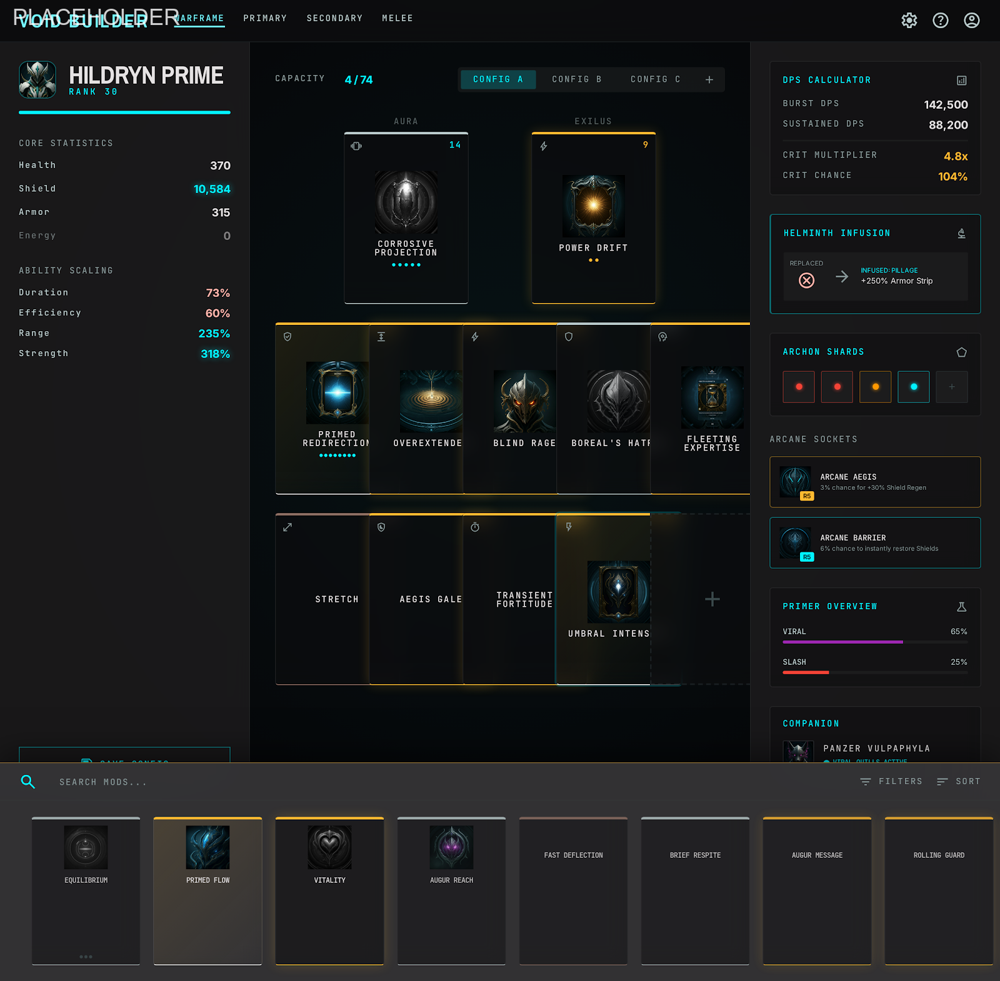

# Forge - Warframe Build Planner

[](https://github.com/millsydotdev/forge/actions/workflows/ci.yml)
[](LICENSE)
[](https://github.com/millsydotdev/forge/releases)
[](CONTRIBUTING.md)

A professional theorycrafting tool for Warframe. Plan, calculate, and share complete builds with accurate math.

> **Placeholder image** — Screenshot pending final UI polish.



## Features

- **Complete build planner** — Warframe, 5 weapon slots, companion, exalted weapons, archwing, operator, AMP, ZAW, kitgun
- **Accurate math engine** — Damage, DPS, EHP, status, crit, CO/GS multipliers, DoT, enemy EHP/TTK
- **Real Warframe data** — Synced from `@wfcd/items` (official WFCD)
- **Riven mods** — Custom stat rolls, disposition, persistence
- **Helminth** — Inject any ability, any frame
- **Archon Shards** — All 6 colors, Tauforged toggle, violet/electric interaction
- **Condition Overload & Galvanized** — Per-status multipliers, viral weighting
- **Set bonuses** — Auto-count, stat injection, UI display
- **Import/Export** — `tndx1:` codec, Overframe link parsing
- **Enemy Lab** — Live EHP/DR/TTK vs any level + armor strip + heat/corrosive
- **Desktop native** — Electron + Overwolf, keyboard shortcuts, context menus

## Quick Start

```bash
# Install dependencies
npm install

# Update game data (from WFCD)
npm run update-data

# Build (preload → main → renderer)
npm run build

# Dev (with GPU disabled, isolated runtime dirs)
npm run start
```

## Commands

| Command | Description |
|---------|-------------|
| `npm run build` | Build all targets sequentially |
| `npm run build:preload` | Build preload only |
| `npm run build:main` | Build main process only |
| `npm run build:renderer` | Build renderer only |
| `npm run build:prod` | Production webpack build |
| `npm run start` | Dev launch (PowerShell script) |
| `npm run build:ow-electron` | Package Windows NSIS installer |
| `npm run lint` | ESLint on src/ |
| `npm run typecheck` | TypeScript noEmit |
| `npm run test` | Vitest unit tests (jsdom) |
| `npm run test:e2e` | Playwright E2E (Windows) |
| `npm run format` | Prettier write |

## Architecture

Forge uses a VS Code-style workspace layout with three main panels.

```
WorkspaceShell
├── LeftSidebar (equipment library, enemies)
├── CenterWorkspace (mod grids, arcane/shards, helminth)
├── RightInspector (StatsHUD, breakdown explorer)
├── BottomDrawer (mod/weapon/arcane library)
├── StatusBar (calculating indicator, health)
└── Modal system (Riven editor, history, comparison, command palette)
```

### Visual Platform

All visual rendering flows through a unified system:
- **VisualManager** — Brand, Theme, Tokens, Assets, CDN, Placeholders
- **PresentationModel** — Standard entity presentation for items
- **CardRenderer** — Universal card rendering
- **RichTooltip** — Diablo-style item tooltips
- **SkeletonLoader** — Shimmer loading states

### State Management (Zustand)

- `buildStore` — full build state (wf, weapons, companion, helminth, shards, loadouts, MR, arcanes, focus, enemy, result)
- `libraryStore` — item catalogs (mods, weapons, warframes, arcanes, companions)
- `uiStore` — activeSlot, inspectorMod, importText, toast, modal, tabs
- `projectStore` — CRUD shell for saved builds

Complex actions live in `useBuildPlannerStore` hook (effects, IPC submission, enrichment).

### Calculation Pipeline

```
buildStore.state → IPC (calculateBuild) → main process → stat-processor → CalculatedStats → UI
```

Main process runs `@wfcd/items` + custom stat processor with systems for:
- Ability damage, effect engine, incarnon, overguard, shield-gating

### Provider Framework

Forge supports data providers for synchronizing with external sources:
- Overwolf provider (player inventory sync)
- Session manager, player event bus, player timeline

### Architecture Decisions

Key decisions are recorded as ADRs in [docs/adr/](docs/adr/):
- ADR-001: Provider Architecture
- ADR-002: Synchronization Rules  
- ADR-003: Workspace Architecture
- ADR-004: Visual Platform Freeze

## Build Codec (`tndx1:`)

Compact base64 JSON for sharing builds.

```
tndx1:eyJ2IjoxLCJtciI6MzAsImYiOiJleGNhbGlidXItcHJpbWUiLC...
```

Full spec: [docs/build-codec.md](docs/build-codec.md)

## Game Data

```bash
npm run update-data
```

Fetches latest from `@wfcd/items` → `src/data/game-data.json` (items, warframes, exalted weapons, archon shards, helminth donors).

## Testing

- Unit: `npm run test` (366 tests, Vitest + RTL + jsdom)
- E2E: `npm run test:e2e` (Playwright, requires `npm run build` first)
- CI: lint → typecheck → test → build (Ubuntu) + E2E (Windows) + NSIS package

## Development

- **Branch**: `master` protected, PR required with review
- **Precommit**: `lint-staged` (eslint --fix + prettier)
- **Deps**: `dependabot.yml` weekly npm updates
- **Node**: 20.x (CI + local)
- **CI gates**: lint → typecheck → test → build (Ubuntu) + E2E (Windows) + NSIS package

## Tech Stack

- Electron (via `@overwolf/ow-electron`)
- React 18 + TypeScript 4.9 (strict)
- Zustand 5 (global state)
- Vitest (unit), Playwright (E2E)
- Webpack 5 (3 targets: main/preload/renderer)
- Dexie (IndexedDB for owned items + builds)
- `@wfcd/items` + `@wfcd/mod-generator` (official Warframe data)

## License

MIT